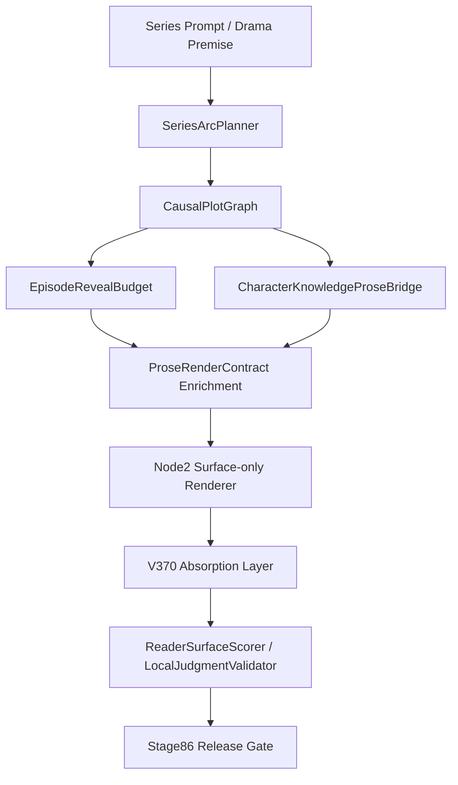

# Stage86 설계도: V380 Arc-Reveal-Knowledge Absorption

작성일: 2026-05-13

## 1. 설계 목표

Stage86은 V380의 Arc-Reveal-Knowledge 기능을 V1700의 Branchpoint OS 안으로 흡수한다.

목표 문장:

```text
16부작 장편 아크, 에피소드별 복선 예산, 인물별 지식 비대칭을 런타임 계약으로 만들고, 산문 렌더링 단계에서 누수 없이 반영한다.
```

## 2. 신규 패키지 구조

```text
src/v1700/arc_reveal_knowledge/
  __init__.py
  arc_contracts.py
  series_arc_planner.py
  causal_plot_graph.py
  reveal_budget.py
  knowledge_contracts.py
  character_knowledge_bridge.py
  prose_contract_bridge.py
  stage86_smoke.py
```

## 3. 핵심 데이터 모델

### 3.1 ArcAct

```text
GI
SEUNG
JEON
GYEOL
```

역할:

16부작 또는 24부작 전체를 기승전결 비율로 배치한다.

### 3.2 ArcPlotNode

필드:

- `episode_id`
- `act`
- `episode_index`
- `tension_level`
- `emotional_target`
- `causal_inputs`
- `forbidden_reveals`
- `required_callbacks`

### 3.3 ArcPlotEdge

엣지 유형:

- `CAUSAL`
- `FORESHADOW`
- `CALLBACK`
- `EMOTIONAL_ESCALATION`

### 3.4 RevealPolicy

정책:

- `ALLOW`
- `FORESHADOW_ONLY`
- `DELAY`
- `BLOCK`

### 3.5 KnowledgeStatus

상태:

- `KNOWS`
- `SUSPECTS`
- `UNAWARE`
- `MISBELIEVES`
- `READER_ONLY`

## 4. 런타임 흐름



## 5. V1700 권위 구조와의 연결

| Stage86 모듈 | V1700 권위 연결 |
| --- | --- |
| SeriesArcPlanner | Stage80 Korean Drama Hierarchy |
| CausalPlotGraph | GraphNexus NarrativeGraph |
| EpisodeRevealBudget | Reveal budget guard / Node2 reveal boundary |
| CharacterKnowledgeProseBridge | Node2 surface-only contract |
| Stage86ReleaseGate | Stage85 traceability + Stage84 absorption + Stage83.1 branchpoint survival |

## 6. 분기점 추가 계획

Stage86에서 `symbol_to_branchpoint_trace_manifest`에 추가할 branchpoint:

| Branchpoint | Priority | 의미 |
| --- | --- | --- |
| `BP_STAGE86_SERIES_ARC_PLANNER` | P0 | 시즌 아크 자동 배치 |
| `BP_STAGE86_CAUSAL_PLOT_GRAPH` | P0 | 에피소드 간 인과/복선/콜백 그래프 |
| `BP_STAGE86_EPISODE_REVEAL_BUDGET` | P0 | reveal 정책 제어 |
| `BP_STAGE86_CHARACTER_KNOWLEDGE_BRIDGE` | P0 | 인물 지식 상태와 산문 제약 연결 |
| `BP_STAGE86_NODE2_NO_KNOWLEDGE_LEAKAGE` | P0 | Node2가 READER_ONLY 정보를 누출하지 않음 |
| `BP_STAGE86_ARC_TO_GRAPHNEXUS_SYNC` | P1 | NarrativeGraph와 arc graph의 동기화 |

## 7. 릴리즈 게이트 설계

신규 게이트:

```text
src/v1700/gates/stage86_release_gate.py
tools/run_stage86_release_gate.py
```

하위 체크:

- `stage85_release_gate = pass`
- `series_arc_planner_smoke = pass`
- `causal_plot_graph_integrity = pass`
- `episode_reveal_budget_policy = pass`
- `character_knowledge_bridge_no_leakage = pass`
- `node2_raw_reveal_access_count = 0`
- `provider_default_calls = 0`
- `symbol_to_branchpoint_trace_coverage >= Stage85 baseline`

## 8. 테스트 설계

신규 테스트:

```text
tests/test_stage86_series_arc_planner.py
tests/test_stage86_causal_plot_graph.py
tests/test_stage86_episode_reveal_budget.py
tests/test_stage86_character_knowledge_bridge.py
tests/test_stage86_release_gate.py
```

테스트 목표:

- 16부작 arc node 생성
- 기승전결 act 분배 검증
- causal/foreshadow/callback edge 추론
- reveal policy violation 차단
- READER_ONLY knowledge leakage 차단
- Node2가 enriched prose contract만 받는지 확인

## 9. 완료 기준

```text
pytest >= 80 passed
stage85_release_gate = pass
stage86_release_gate = pass
main_release_gate = pass
provider_default_calls = 0
node2_raw_reveal_access_count = 0
P0 Stage86 branchpoint coverage = 100%
16-episode arc smoke = pass
reveal leakage count = 0
knowledge leakage count = 0
```

